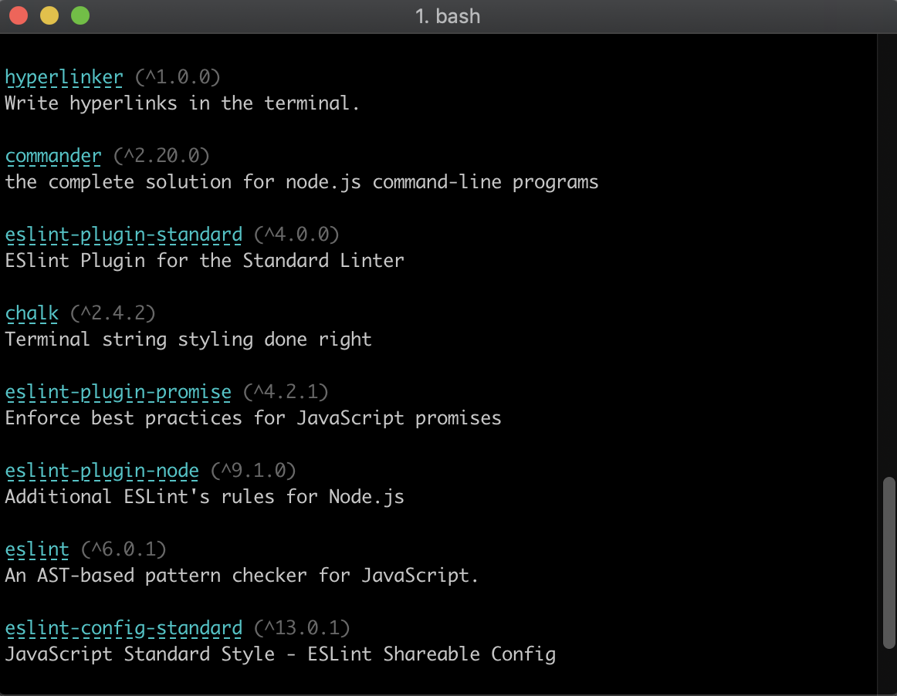

# NPM Views

> List and describe project dependencies

[](https://npmjs.org/package/npm-views "View this project on npm")
[](https://github.com/VeronQ/npm-views/blob/master/LICENSE)
 

 
## Installation

```sh
$ npm install -g npm-views
```

## Usage

```sh
$ npm-views --help

  Usage: cli <filePath>

  List and describe project dependencies

  Options:
    -v, --version  output the version number
    -h, --help     output usage information
```

## License

MIT
